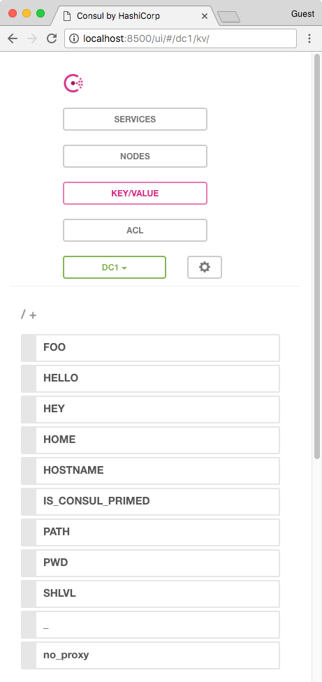

# consul-kv-primer docker image

[Docker image here](https://hub.docker.com/r/totallymoney/consul-kv-primer/)

[Consul](http://www.consul.io) does not provide an easy way to populate its key-value store on start-up.

This can be a problem when working locally if your application depends on config that should already be in consul's kv store (as it would be in a production-like env).

This image is designed to mitigate the issue when your target environment is started by docker-compose. Simply provide the service with the env vars required using the `environment` or `env_file` properties.

The image will wait for docker to startup, then pass all its env vars using [consul's http api](https://www.consul.io/api/kv.html#create-update-key). Once finished, it will set key `IS_CONSUL_PRIMED` with value `true`.

## Example

`.env`

    FOO=bar
    HELLO=world
    HEY=youguys

`docker-compose.yml`

    version: '2'
    services:

      consul-kv-primer:
        image: totallymoney/consul-kv-primer
        depends_on:
          - consul
        env_file: ./.env
        environment:
          - CONSUL_URL=http://consul:8500
      
      consul:
        image: consul
        ports:
          - "8500:8500"

With the above in place, run the following

    $ docker-compose up consul-kv-primer

Consul will then be available on port 8500 with a primed key-value store.

    $ curl http://localhost:8500/v1/kv/HELLO\?raw
    world

